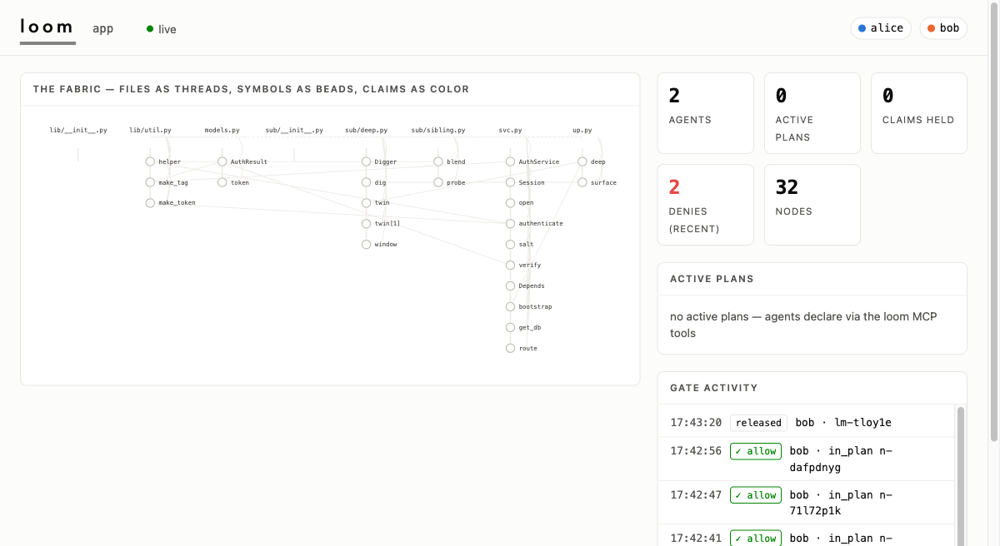
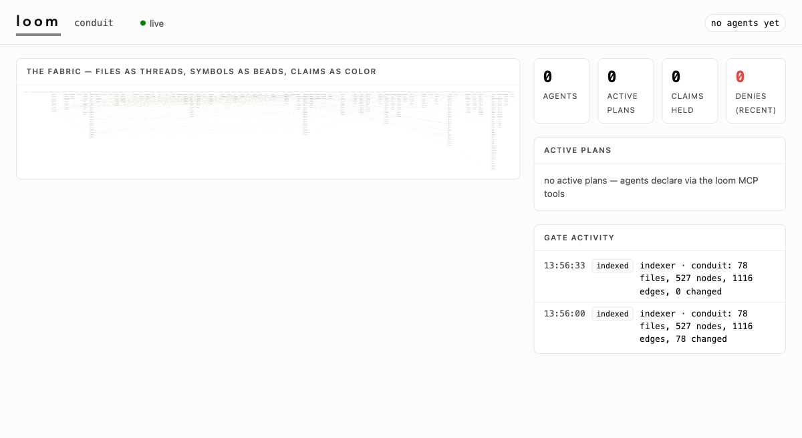

# loom

**Many threads, one fabric, no tangles.** A coordination gate for teams of coding agents (multiple
users, multiple machines, one or many git repositories): every agent must declare a plan — which
symbols it will change and why — before editing. Overlapping plans are refused at declare time with the
owner's spec embedded in the refusal, and a Claude Code PreToolUse hook enforces the claims at edit
time, so the merge conflict never gets written.

One process, one SQLite store: the code graph (tree-sitter indexed, function-level), the plans,
and the claims live behind one server, and check-and-claim is a single `BEGIN IMMEDIATE`
transaction — no race window between checking and claiming.



## Install

Requirements: **Python 3.12 or newer**, [**uv**](https://docs.astral.sh/uv/), and git. loom is not
on PyPI; install it from source.

```bash
git clone <this-repo-url> loom
cd loom
uv sync
```

`uv sync` builds a virtualenv at `<loom>/.venv` and puts the two console scripts, `loom` and
`loom-gate`, inside it. It does **not** put them on your PATH. Pick one of these and use it
everywhere below:

```bash
# either prefix every command (works from any directory — this is what the examples do)
uv run --directory /abs/path/to/loom loom doctor --repo-root "$PWD"

# or put the venv on your PATH once, and drop the prefix
export PATH="/abs/path/to/loom/.venv/bin:$PATH"
loom doctor
```

The prefix matters because `loom-gate` must be findable by name: `loom init` registers it as a
PreToolUse hook command, and `loom doctor` fails the "gate binary" check if it is not on PATH. In
the examples below, `<loom>` is the absolute path to your checkout.

Note that `uv run --directory` also changes the working directory to `<loom>`. That is why the
examples pass `--repo-root "$PWD"` and `--db` explicitly: without them, loom would operate on its
own source tree instead of yours.

## Quickstart (two users, two machines)

**Team lead, once — anywhere both machines can reach:**

```bash
uv run --directory <loom> loom serve --repo-root /path/to/shared-repo-clone --port 8790
```

Serving indexes the repo (functions, classes, CALLS/IMPORTS/CONTAINS edges) and exposes the MCP
tool surface at `/mcp` plus the hook's fast `POST /gate` endpoint. `--host` defaults to `0.0.0.0`
and `--port` to `8790`.

**Each user, once, inside their clone of the shared repo:**

```bash
cd /path/to/my/clone
uv run --directory <loom> loom init \
  --server http://<host>:8790 --agent <your-name> --repo-root "$PWD"
```

`init` merges the PreToolUse gate into the repo's `.claude/settings.json` (idempotent, never
overwrites your other hooks), registers the loom server in the repo's `.mcp.json` so your agent
can actually call the tools the protocol tells it to call, appends the protocol snippet to
`CLAUDE.md`, writes a **per-repo** `.claude/loom.toml` (with `~/.loom/config.toml` as the
fallback — so initializing a second repo can never point this one's gate at the wrong server),
pings the server, and verifies the gate with a synthetic payload. After that you never touch
loom again — you just talk to your agent.

`--agent` defaults to `$USER`. `LOOM_AGENT` overrides the configured identity per process, and
`LOOM_CONFIG` replaces the config path outright; both exist for the case of several agents sharing
one OS user.

## Several repositories, one server

`--repo-root` is repeatable, and each root may be named. One process, one database, one
dashboard, one gate endpoint — the graph, plans and claims are keyed by repo name, so the same
`svc.py` in two repos is two independent symbols that never contend:

```bash
uv run --directory <loom> loom serve \
  --repo-root api=/srv/checkouts/api \
  --repo-root web=/srv/checkouts/web \
  --db /srv/loom/loom.sqlite3 --port 8790
```

`NAME=` is optional (the name defaults to the directory's basename), names must be unique, and
**pass `--db` explicitly whenever you serve more than one root** — otherwise the database lands
beside the *first* root, which is a rule your team has to remember. Every root is indexed at boot,
one `loom: indexed {...}` line per repo.

Users then name the repo their checkout belongs to:

```bash
uv run --directory <loom> loom init \
  --server http://<host>:8790 --agent <your-name> --repo api --repo-root "$PWD"
```

With one served repo `--repo` stays optional; with several it is required, and omitting it prints
the served names. Re-index a single repo with
`loom index --repo api --repo-root /srv/checkouts/api --db /srv/loom/loom.sqlite3` — **on a
multi-root server `--db` is mandatory here too**, or you will index into a second, empty database
that the running server never reads.

## Locking it down (optional shared token)

By default the server is open to anyone who can reach the port. Give it a shared secret and every
client must present it:

```bash
uv run --directory <loom> loom serve --repo-root /path/to/clone --token "$LOOM_TOKEN" --port 8790
uv run --directory <loom> loom init  --server http://<host>:8790 --agent <you> \
  --token "$LOOM_TOKEN" --repo-root "$PWD"
```

`/gate`, `/state` and `/mcp` then answer 401 without the bearer; `/health` stays open so `init` and
`doctor` can learn that a token is required before they own one. `init` refuses to half-wire a
checkout against a tokened server, and plumbs the header into `.mcp.json` so the agent's MCP client
authenticates too. `LOOM_TOKEN` in the server's environment is the fallback for `--token`; the flag
wins.

This is one shared team secret, sent in plaintext unless you put TLS or a private network in front
of it. It authenticates the transport, not the agent name in the payload. See
[SECURITY.md](SECURITY.md) before exposing a server to a network you do not control.

The dashboard cannot read a tokened server — it polls `/state` from the browser with no
credential, and will sit on "reconnecting".

## Is it wired up? (`loom doctor`)

```bash
uv run --directory <loom> loom doctor --repo-root "$PWD"     # inside your checkout
```

Ten checks, one PASS/FAIL/WARN row each, exit 0 unless something FAILs: the config file that
wins discovery, the server's reachability and served repos (with its auth mode), whether the
shared token your config carries satisfies that server, whether your configured repo is one of
them, `loom-gate` on PATH, the PreToolUse hook in `.claude/settings.json`, the loom entry in
`.mcp.json`, a **real** gate round-trip (a synthetic payload through the actual hook binary, which
must exit 2), whether your repo has an index yet, and whether that index has fallen behind the
working tree. The last two are WARN, not FAIL — each is a one-command fix.

It is the fastest answer to "is loom actually doing anything here?". Every row is mapped to a fix
in [docs/troubleshooting.md](docs/troubleshooting.md).

## The protocol (what agents do)

1. Before any code change: write a one-page spec (goal, write targets as node refs, exact
   new/changed interfaces, assumes, out of scope), resolve targets with `resolve_nodes`, call
   `declare_plan`. The template is `src/loom/templates/spec.md` in this repo, and `loom init`
   prints its installed path.
2. On conflict, the response embeds every clashing plan's full spec inline — replan against their
   declared interfaces, adjust targets, declare again.
3. Edit normally. The hook allows in-plan edits silently; a foreign-claim edit is blocked (exit 2)
   with the owner's spec in the message; out-of-scope edits are told to `rescope`.
4. When merged: `release`. Claims also expire on TTL (30 min, renewed implicitly on activity), so
   a crashed agent never freezes the team.
5. If the server is unreachable — or merely slow — the gate **fails open** with a loud warning:
   a 1.5s socket timeout, backed by a 2.5s hard wall deadline so that no server can stall an
   edit by dribbling a response. Work continues, coordination degrades, edits are never bricked.

The nine MCP tools, the `/gate` wire contract and all six decision cases are documented in
[docs/protocol.md](docs/protocol.md).

## Watching the board

The server's home page is a live one-page dashboard: the code graph drawn as warp threads with
claim colors, an agent chip per active teammate, plans with their TTLs counting down, and the
gate's decision feed. Read-only, no build step — it polls `/state`.

```
http://<host>:8790/
```

Past about a dozen files the fabric focuses itself: threads carrying live claims are always drawn,
the rest of the budget goes to the biggest remaining files, and the header says how many of how
many you are looking at. A whole repository drawn at once is a smear, so the board narrows rather
than shrink everything.



From a shell (these read the database directly, so they run on the machine that has it, and take
`--db` when it is not beside the current directory):

```bash
uv run --directory <loom> loom ls    --db /srv/loom/loom.sqlite3            # active claims
uv run --directory <loom> loom show  --db /srv/loom/loom.sqlite3 lm-xxxxx   # a plan (or n-xxxxx)
uv run --directory <loom> loom release --db /srv/loom/loom.sqlite3 lm-xxxxx --agent <name>
uv run --directory <loom> loom index --repo-root <repo> --changed           # manual re-index
```

`ls`, `show` and `release` are local-database verbs — there is no remote CLI yet. From another
machine, use the MCP tools (`list_claims`, `get_plan`, `release`) or the dashboard.

## See it work (60 seconds, no setup)

```bash
uv run --directory <loom> python -m loom.eval.harness --demo
```

Boots a real server on a throwaway db, indexes a fixture repo, and scripts the headline sequence:
agent A declares over `AuthService/authenticate` → agent B's overlapping declare is refused with
A's spec embedded → B's edit on A's symbol is blocked by the real gate subprocess (exit 2, spec in
stderr) → B's edit on its own symbol passes silently → A releases and the symbol frees. Every step
carries an inline assert, and `tests/eval/test_demo.py` runs the whole thing in CI.

## Tests

```bash
uv run --directory <loom> pytest tests -q
```

`tests/server/test_concurrency.py` is the one that matters: two HTTP clients race `declare_plan`
on overlapping targets against a real subprocess server — exactly one wins, the loser gets the
winner's spec. `test_multirepo.py` is its multi-repo twin (the same symbol name claimed in two
served repos must not contend), and `test_doctor.py` runs the ten checks against a live server
and a checkout wired by the real `loom init`.

## Reading the code (in this order)

| File | What it holds | Lines |
|---|---|---|
| `src/loom/server/db.py` | schema + the one transaction primitive (`immediate`) | 159 |
| `src/loom/server/ids.py` | how a node id and a plan id are minted | 101 |
| `src/loom/server/claims.py` | the whole judgement: declare, conflict, TTL, deny | 541 |
| `src/loom/server/tools.py` | the nine MCP tools; thin adapters over `claims.py` | 178 |
| `src/loom/server/app.py` | routes (`/health` `/state` `/gate`), multi-repo, auth | 445 |
| `src/loom/hook/locator.py` | tool payload → `(path, qualname)`; stdlib `ast` only | 147 |
| `src/loom/hook/gate.py` | the PreToolUse process: exit 0 or 2, always fail-open | 200 |
| `src/loom/indexer/walk.py` | two-pass tree-sitter index; cold ≡ incremental | 216 |
| `src/loom/cli/main.py` | serve · init · doctor · index · ls · show · release | 644 |

[docs/architecture.md](docs/architecture.md) is the five-minute version of the same tour.

## Documentation

- [docs/README.md](docs/README.md) — index of every document, with a status column
- [docs/protocol.md](docs/protocol.md) — the nine MCP tools, the `/gate` wire, the six cases
- [docs/architecture.md](docs/architecture.md) — how the pieces fit and why
- [docs/operations.md](docs/operations.md) — running a server: database, backups, re-indexing
- [docs/troubleshooting.md](docs/troubleshooting.md) — one section per `loom doctor` row
- [CONTRIBUTING.md](CONTRIBUTING.md) · [SECURITY.md](SECURITY.md) · [CHANGELOG.md](CHANGELOG.md)

Claims are **advisory with TTL**, never hard locks; write-write blocks, read/write mismatches
warn with the owner's spec attached. Qualnames follow Serena's convention:
`path/to/file.py::Class/method`.

## MVP limits (deliberate)

Python-only indexing. Identity is caller-asserted: an agent sends its own name and loom believes
it, and the optional shared token authenticates the transport rather than the agent (there is no
per-repo auth). No cross-repo edges or claims — a plan lives in exactly one repo. No rename
tracking. No impact analysis beyond one-hop CALLS expansion. The eval's real-codebase three-arm
runs are post-MVP (the harness and metrics ship now).

The indexer also skips a fixed set of directories, including `tests/`, `frontend/` and `alembic/`
(`src/loom/indexer/walk.py`). Skipped directories get no nodes, so edits inside them are always
allowed: **symbols under `tests/` are not claimable.** The set is not configurable yet.

## License and credits

Apache-2.0 — see [LICENSE](LICENSE) and [NOTICE](NOTICE).

[THIRD_PARTY_NOTICES.md](THIRD_PARTY_NOTICES.md) lists the three projects loom derives code from,
with their licenses. [CREDITS.md](CREDITS.md) lists the projects that shaped loom's design without
contributing code.
